# Twitter-Sentiment-Analysis

Import Libraries and Datasets
------------------------
```
import pandas as pd
import numpy as np
import seaborn as sns
import matplotlib.pyplot as plt
!apt jupyterthemes
from jupyterthemes import jtplot
jtplot.style(theme='monokai', context='notebook', ticks=True, grid=False) 
# setting the style of the notebook to be monokai theme  
# this line of code is important to ensure that we are able to see the x and y axes clearly
# If you don't run this code line, you will notice that the xlabel and ylabel on any plot is black on black and it will be hard to see them. 
```

```
# Load the data
tweets_df = pd.read_csv('twitter.csv')
tweets_df
```

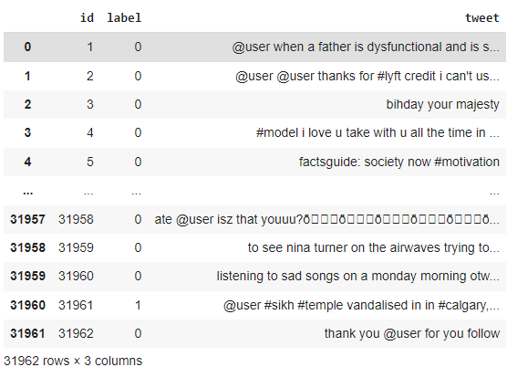

```
tweets_df.info()
```

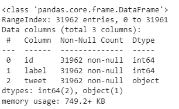

```
tweets_df.describe()
```

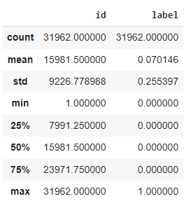

```
# Drop the 'id' column
tweets_df['tweet']
tweets_df = tweets_df.drop(['id'], axis=1)
```

Perform Data Exploration
-----------------------------
```
sns.heatmap(tweets_df.isnull(), yticklabels = False, cbar = False, cmap="Blues")
```

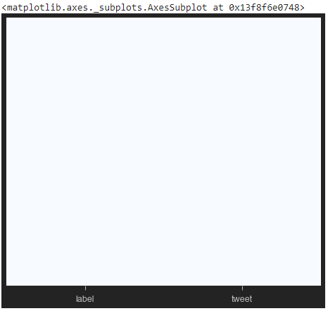

```
tweets_df.hist(bins = 30, figsize = (13,5), color = 'r')
```

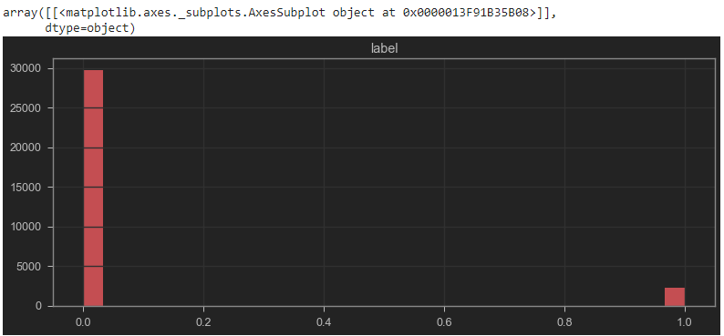

```
sns.countplot(tweets_df['label'], label = "Count") 
```

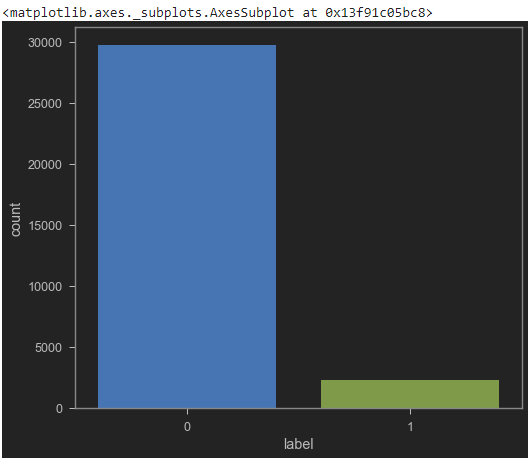

Let's get the length of the messages
```
tweets_df['length'] = tweets_df['tweet'].apply(len)
tweets_df
tweets_df.describe()
# Let's see the shortest message 
tweets_df[tweets_df['length'] == 11]['tweet'].iloc[0] # it's 'i love you '
# Let's view the message with mean length 
tweets_df[tweets_df['length'] == 84]['tweet'].iloc[0]
'my mom shares the same bihday as @user   bihday snake! see you this weekend ð\x9f\x99\x8cð\x9f\x8f¼'
# Plot the histogram of the length column
tweets_df['length'].plot(bins=100, kind='hist')
```

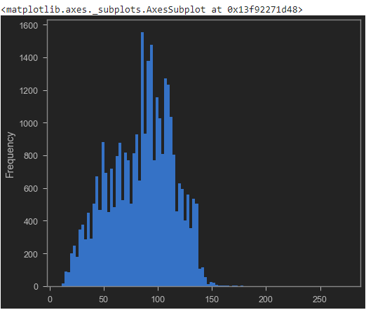

Plot the WordCloud (My fav part!)
------------------
```
positive = tweets_df[tweets_df['label']==0]
positive
```

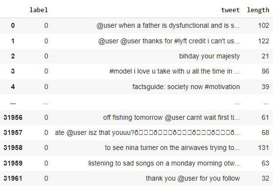

```
negative = tweets_df[tweets_df['label']==1]
negative
```

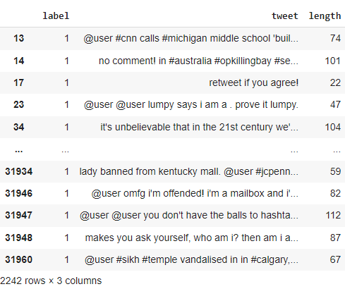

```
sentences = tweets_df['tweet'].tolist()
len(sentences)
# this should show 31962
sentences_as_one_string =" ".join(sentences)
sentences_as_one_string
```
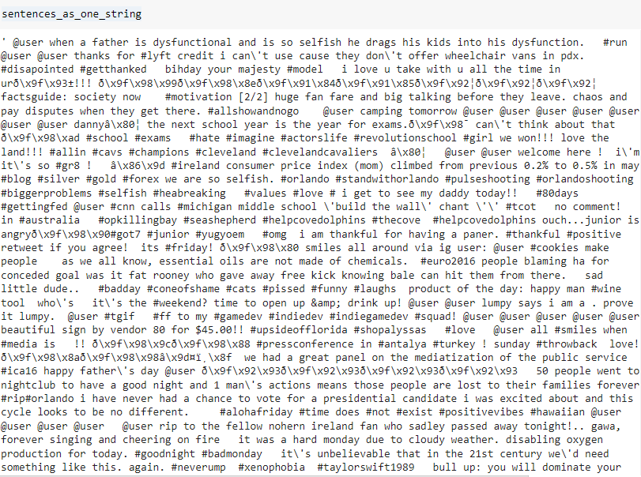


```
from wordcloud import WordCloud

plt.figure(figsize=(20,20))
plt.imshow(WordCloud().generate(sentences_as_one_string))
```

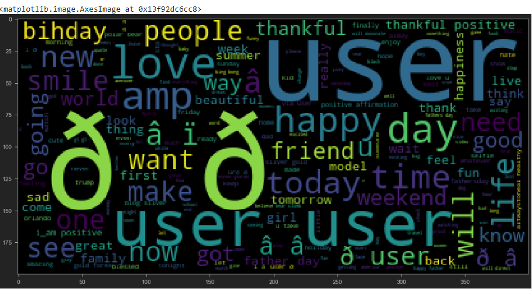


Perform Data Cleaning - Remove Punctuation From Text 
------------------------------------
```
import string
string.punctuation
```

```
Test = '$I love AI & Machine learning!!'
Test_punc_removed = [char for char in Test if char not in string.punctuation]
Test_punc_removed_join = ''.join(Test_punc_removed)
Test_punc_removed_join # this should print 'I love AI  Machine learning'
```

```
Test = 'Good morning beautiful people :)... I am having fun learning Machine learning and AI!!'
Test_punc_removed = [char for char in Test if char not in string.punctuation]
Test_punc_removed
# Join the characters again to form the string.
Test_punc_removed_join = ''.join(Test_punc_removed)
Test_punc_removed_join # this should print 'Good morning beautiful people  I am having fun learning Machine learning and AI'
```

Data Cleaning - Remove Stopwords
------------
```
import nltk # Natural Language tool kit 
nltk.download('stopwords')

# You have to download stopwords Package to execute this command
from nltk.corpus import stopwords
stopwords.words('english')
```
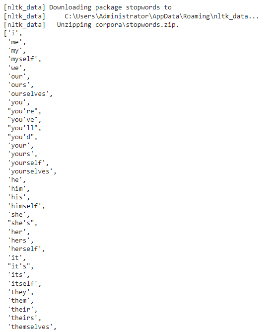

```
Test_punc_removed_join = 'I enjoy coding, programming and Artificial intelligence'
Test_punc_removed_join_clean = [word for word in Test_punc_removed_join.split() if word.lower() not in stopwords.words('english')]
```

```
Test_punc_removed_join_clean # Only important (no so common) words are left
```
This should print out ['enjoy', 'coding,', 'programming', 'Artificial', 'intelligence']

```
Test_punc_removed_join
```
This should print out 'I enjoy coding, programming and Artificial intelligence'

Perform Count Vecotorization (Tokenization)
----------
```
from sklearn.feature_extraction.text import CountVectorizer
sample_data = ['This is the first paper.','This document is the second paper.','And this is the third one.','Is this the first paper?']

vectorizer = CountVectorizer()
X = vectorizer.fit_transform(sample_data)

print(vectorizer.get_feature_names())
# ['and', 'document', 'first', 'is', 'one', 'paper', 'second', 'the', 'third', 'this']
print(X.toarray())  
```
x.toarray should print: 
[[0 0 1 1 0 1 0 1 0 1]
 [0 1 0 1 0 1 1 1 0 1]
 [1 0 0 1 1 0 0 1 1 1]
 [0 0 1 1 0 1 0 1 0 1]]

Create a Pipeline to Remove PUnctuations, Stopwords, and Perform Count Vectorization
```
# Let's define a pipeline to clean up all the messages 
# The pipeline performs the following: (1) remove punctuation, (2) remove stopwords

def message_cleaning(message):
    Test_punc_removed = [char for char in message if char not in string.punctuation]
    Test_punc_removed_join = ''.join(Test_punc_removed)
    Test_punc_removed_join_clean = [word for word in Test_punc_removed_join.split() if word.lower() not in stopwords.words('english')]
    return Test_punc_removed_join_clean
    
# Let's test the newly added function
tweets_df_clean = tweets_df['tweet'].apply(message_cleaning)
print(tweets_df_clean[5]) # show the cleaned up version
print(tweets_df['tweet'][5]) # show the original version
```

this should print
[2/2] huge fan fare and big talking before they leave. chaos and pay disputes when they get there. #allshowandnogo

```
from sklearn.feature_extraction.text import CountVectorizer
# Define the cleaning pipeline we defined earlier
vectorizer = CountVectorizer(analyzer = message_cleaning, dtype = np.uint8)
tweets_countvectorizer = vectorizer.fit_transform(tweets_df['tweet'])

print(vectorizer.get_feature_names())
# this should print: ['0', '0000001', '00027', '001', '0035', '00h30', '01', '0115', '0161', '019', '01926889917', '02', '0265', '0266808099', '02900', '03', '030916', '03111880779', '032', '033', '0345', '039', '04', '045', '04k', '05', '0506823156', '06', '06052016', '0606', '060616', '0608', '0608wed', '0609', '0610', '061116', '0612', '0613', '0616', '0617', '0618', '0618saturday7monthscouple', '0618â\x99¡', '0620', '06202016', '0622', '0624', '06Â', '07', '07000', '07040', '07044', '07150', '07190', '07400', '07468', '07500', '076', '07788427999', ....]
print(tweets_countvectorizer.toarray())  
tweets_countvectorizer.shape # this should show (31962, 47386)

X = pd.DataFrame(tweets_countvectorizer.toarray())
y = tweets_df['label']
```

Train and Evaluate a Naive Bayes Classifier Model 
```
X.shape # (31962, 47386)
y.shape # (31962,)


from sklearn.model_selection import train_test_split
X_train, X_test, y_train, y_test = train_test_split(X, y, test_size=0.2)

from sklearn.naive_bayes import MultinomialNB

NB_classifier = MultinomialNB()
NB_classifier.fit(X_train, y_train)
# MultinomialNB(alpha=1.0, class_prior=None, fit_prior=True)
```

```
from sklearn.metrics import classification_report, confusion_matrix
# Predicting the Test set results
y_predict_test = NB_classifier.predict(X_test)
cm = confusion_matrix(y_test, y_predict_test)
sns.heatmap(cm, annot=True)
```
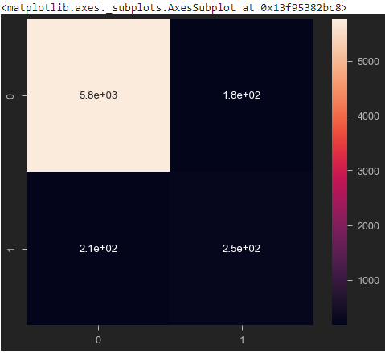

```
print(classification_report(y_test, y_predict_test))
```

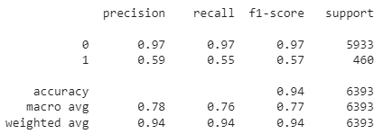


